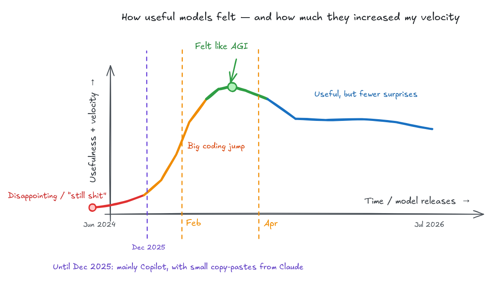

Well... at least for now.

I really enjoy listening to [The Standup Pod](https://thestanduppod.com/) while vibe coding things that I regret two hours later. Anyway, I was listening to [Offsite: Pi | Standup #67](https://www.youtube.com/watch?v=bPcf00mcMTk).

Quoting Dillon Mulroy:

> I don't want smarter models. I don't want models are getting like RL on these like long horizon tasks. Like I don't use agents that way. I haven't seen agents be successful that way. They're okay. Let me backtrack. They're good for the long horizon stuff for like debugging and triaging.

I have the same feeling. I still miss the models we had between February and April 2026. Here is a plot of how I felt:

For me, their usefulness peaked during that period. Newer models remain useful and powerful, but they surprise me less.

Long-horizon agents have worked beautifully for me when debugging. I used to flex my ability to debug and SSH into machines to find issues. Holy cow, these models are so good at it. They know all the right commands, and when I give a model a way to receive feedback, it helps me fix all kinds of bugs, including hardware issues.

Outside debugging and triaging, however, I haven't had much success with agents handling very long-horizon tasks without my interaction.

The newer models also feel less steerable. Fable/Opus 5 always thinks it's better than you and takes ages to do a task, only to do everything except what you asked it to do. GPT-5.6 Sol feels more steerable, but it still sometimes runs for more than 50 turns. My guess is that they tried to make these models tackle long, [autoresearch](https://github.com/karpathy/autoresearch) style runs, but now the models overrun tasks. I would rather have an autoresearch plugin that I can control than models that default to long runs. But that is just me 🤷‍♂️
