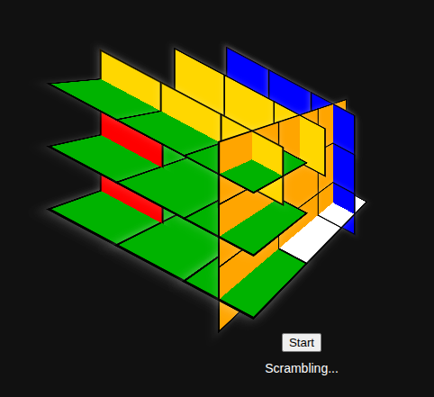

[NVIDIA Nemotron 3.5 Lightning 30B A3B GGUF](https://huggingface.co/ggml-org/NVIDIA-Nemotron-3.5-Lightning-30B-A3B-GGUF)


```bash
llama serve \
     -hf ggml-org/NVIDIA-Nemotron-3.5-Lightning-30B-A3B-GGUF:Q4_0 \
     -ngl auto \
     -c 262144 -np 1 \
     -ctk q8_0 -ctv q8_0 \
     -fa on --fit on \
     --spec-type draft-mtp \
     --spec-draft-n-max 3 \
     --jinja --kv-unified \
     --temp 1.0 --top-p 0.95 --top-k 0 --min-p 0 \
     --reasoning on --reasoning-format deepseek \
     --no-reasoning-preserve \
     --host 0.0.0.0 --port 8080 \
     --alias nemotron-3.5-lightning
```

I asked it to build a Rubik's Cube game:



[Prompt](https://github.com/JafarAbdi/myconfigs/blob/main/claude/.claude/commands/rubiks_cube.md)

Anyway, Gemma4 31B is still my favorite and most useful model.
